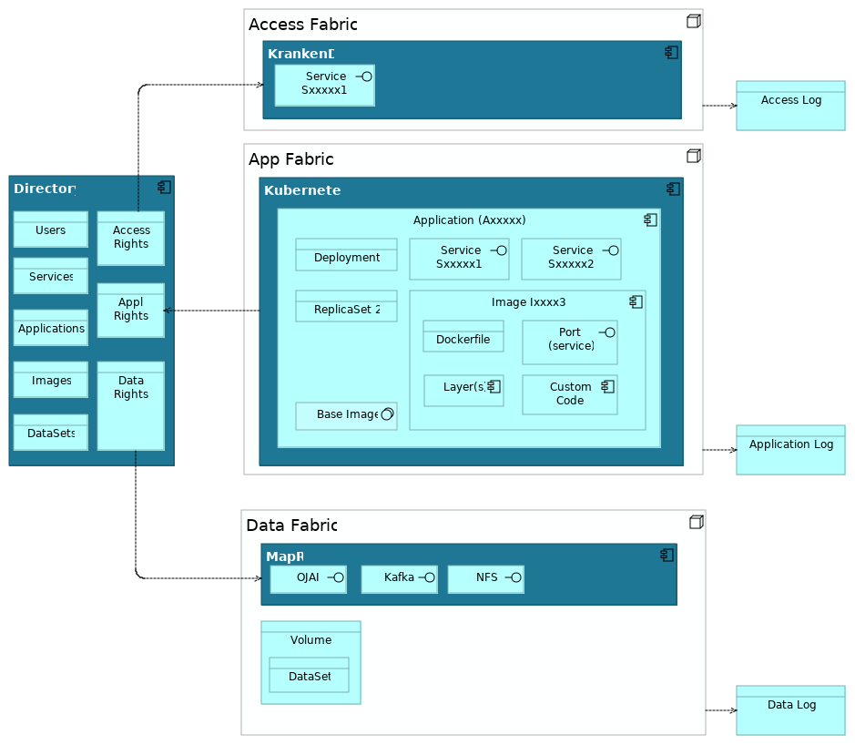

# Specification   GovCloud PaaS  Statens IT

**[Platform Layers]** Three seperate layers: gateway, application, data
**[Staging]** Applications, services and data sets can deploy to multiple stages of the GovCloud.

## User Stories
The version 1.0 of the GovCloud PaaS (primo 2019) is builded to support the following user stories:

## Principles

Continuous Services, Vendor neutrality, High Scaleability, Security-by-design, GDPR-by-design, DevOps and Predictable Cost.

Architectural consequences:

**Enterprise Grade Products**, to support high scaleability with predictable cost.

**Open Source supported interfaces**, to support  vendor neutrality and predictable cost.

**Self-Service (and automation)**, to support Continous Services, High Scaleability and DevOps.

## Governing Thoughts....

Layered architecture (each layer scale idependently and different governance processes for: Data, Application and Access)

One platform? (staging on the same platform, run on dev laptop, integrated automated test, multiple versions of same service, active-active)

## Data Fabric

### MapR

- The data fabric is running latest version of [MapR](https://mapr.com/).
- Initially MapR uses one Topology (clusters of identical hardware, identical OS)
- Update zones, Connectivity Zones??
- Active-Active (passive is not effective use...)
- The `mapr` user should not use default name, UID and GUID.
- Run as non-root?
- Access to the MapR Control System is done through a Linux PAM connected to the central Directory using regular administrative SIT user accounts.
- Load Balancing using MapR Gateways? (L7, L3-4?, Locations?, Common endpoints across locations)

### Datasets

- Each customer has its own MapR Volume and is Data Responsible for all data stored.
- Each [Dataset] are stored in seperate sub-volumes and can have multiple representations (file, table, stream).
- Datasets are given an identity in the central Directory (mapping Dxxxxx to MapR path, storing access rights and ADMS metadata).
- Access to MapR volumes are given to [Application]s and [User]s in the central Directory. (Or should it really be Images?)
- Datasets are encrypted at rest (what keys? control?)

### Logs

- All operations on datasets are logged into one datalog stream (Log4J specification needed!), and later split on a per customer base.

## App Fabric

### Kubernetes
- The application management environment is the latest standalone version of [Kubernetes](https://kubernetes.io/).
- [Application]s are given an identity in the central Directory (Axxxxx, storing ownership, access rights and "Systembeskrivelser").
- Each Application is defined by a Kubernetes Deployment.
- Each Application exposes Application Services through the use of LoadBalancers.
- Application Services are given an identity in the central Directory (mapping Sxxxxx to Applications, storing access rights and metadata).
- (consequence that all application services have access to same datasets?)

### Docker
- The containarized application runtime environment is the latest version of [Docker](https://www.docker.com) supported by kubernetes.
- Docker [Images] are build using a common virtual image both in development and operation.
- All images are based on platform specific [Base Image].
- Each image exposed Image Services accesible only to other images in the same [Application].
- Each images implement a common schema for monitoring (should this be done at application level?)
- Each images implement a common schema for logging (should this be done at application level?)

## API Fabric
- The API Gateway is [KrakenD](http://www.krakend.io/).
- Access to Application

### Applications
- Applications are responsible for implementing access policies to data at row level
- Access policies should rely on trusted attributes over detailes rights when possible.

## Platformservices

### Authentication

**[Secure Token Service]** All services use a common secure token platform service.
**[Federation]** Authentication of end-users are done in federation.

### Authorization

**[Rights]** All access rights (end-users and other services) are given by service or data responsible to identities recognized by the secure token service. [Uklar]
**[Authorization]** Access policy on service level is enforced in Gateway, Access policy on data level in Service

### API Key Management
**[API Service]** Private users of Open Government Data on the GovCloud are registered with a API key.
**[API Keys]** Public Data Sharing is supported by a GovCloud platform service for API key management.

### Log

**[Log Service]** All services use a common logging service.

### Repository
Code and image...
**[Code service]** The code repository of applications and platform services is [GIT](https://git-scm.com/) and is a platform service at SIT.
**[Versioned Configuration]** SIT is using existing tools to maintain versions of configuration items used in the platform and in platform services.
**[Registry]** The artefact repository is [Docker Registry Server](https://docs.docker.com/registry/deploying/#use-an-insecure-registry-testing-only).

### Directory

**[Central Directory]** Users, Applications, Services and Dataset are ressources registered in the central directory service at SIT.

## GovDev SaaS

**[Gov Dev Tool]** SIT offers an enterprise grade 'Government Development Toolchain' as Software-as-a-Service to support agile application development.
**[Consumer Tool]** GovCloud Consumers may choose between using SIT’s SaaS toolchain and providing their own toolchain, contingent on the Consumer’s toolchain’s complete integration with the build and test processes from SIT.

## Sandbox SaaS
**[Sandbox]** SIT provides limited unsupported free-of-charge GovCloud ressources to existing and prospect consumers for evaluation purposes.

## Collaboration SaaS
**[SharedOperation]** SIT provides collaborative tools to support collaboration during normal operation and during incident handling.

# Concepts and Terms....

[Application]: #application "A unit of governance"
[Dataset]: #dataset "A unit of governance"

[Log]: #datalog "A unit of governance"
  [Data Log]: #datalog "A unit of governance"
[Image]: #image "A unit of governance"
  [Base Image]: #image "A unit of governance"

[User]: #user "Physical person or Application instance outside the platform"

------------------

1. **[SysAdm tooling]** Operators at the Platform Provider choose tools suitable for automation and remote management based on individual experiences.
1. **[Test Image]** Automated test of services are done using a custom image maintained by SIT.
1. **[Acceptance test]** Service passing the provided automated tests are considered running.
1. **[Release]** Consumers label images in the repository for release based on test results.
1. **[Deploy]** In the initial version of the GovCloud PaaS releases of new versions of application services are done manually by SIT on request from the Cloud Consumer.
1. **[SLA management]** SIT is using existing tools and channels to provide data on the fullfillment of SLA and other agreements.
